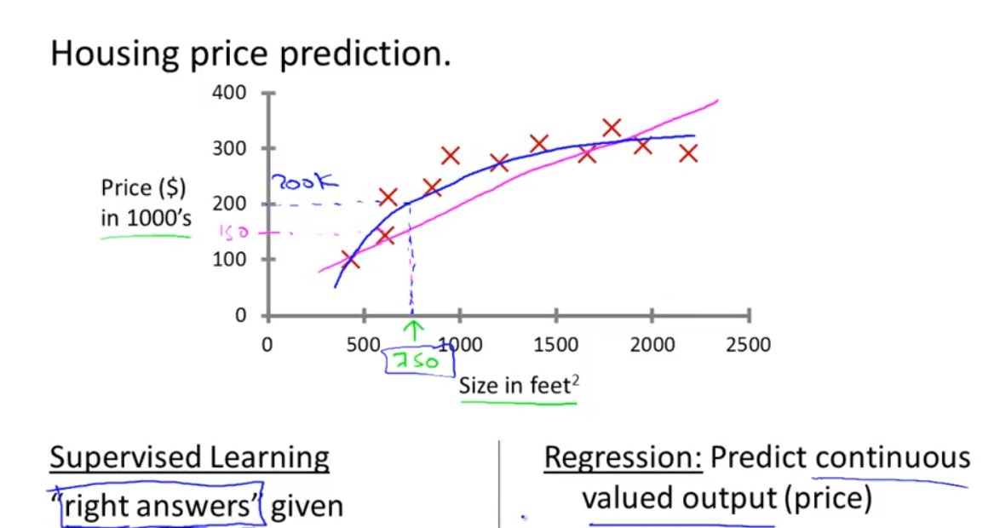
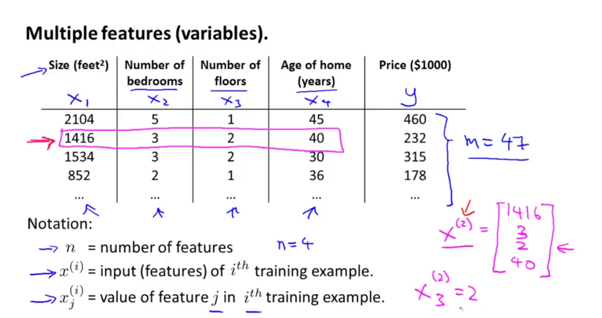
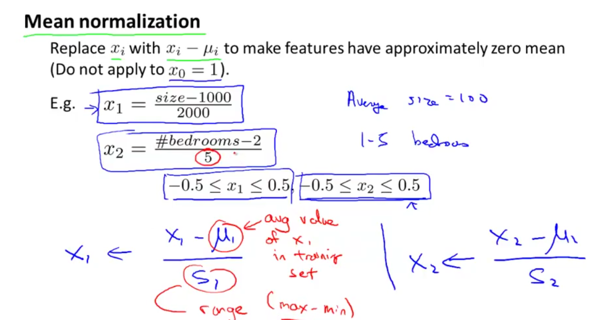
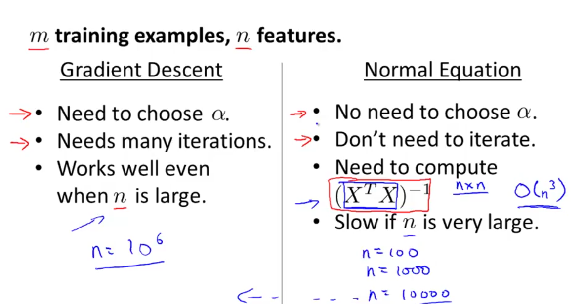
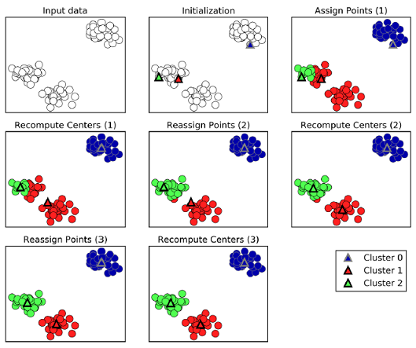
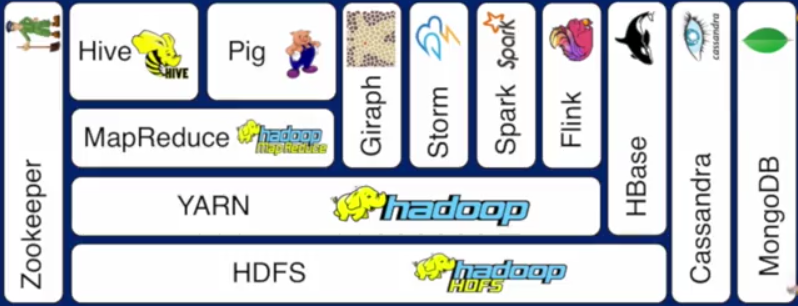

[]()
[]()

# Artificial Intelligence vs Machine Learning vs Deep Learning

- Artificial Intelligence(AI) is any technique which enables machines/computers to mimic human behaviour
- Machine Learning(ML) is subset of AI that use Statistical methods for machines/computers to learn without being explicitly programmed and improve with experience
- Deep Learning is subset of ML that use Multi-Layer Neural Network computation more feasible

# Knowledge needed to master in this area
## Mathematics (http://www.deeplearningbook.org/)
- [X] Linear Algebra
- [X] Probability Theory & Statistics
- [X] Multivariate Calculus
- [X] Algorithm & Complexity

# Type of Machine Learning Algorithms
- Supervised Learning (From a target (dependent variable) to be predicted from given set of predictors (independent variables)
- Unsupervised Learning (No target (dependent variable) usually used for clustering)
- Reinforcement Learning (Machine is trained to make decisions based on algorithm to learn from previous experience)


# TERMINOLOGY
- Supervised Machine Learning- Combining input from learning to produce useful predictions on unseen data
- Example = Regression problem (predict the value of house- continuous value) and Classification problem (determine which is more likely   to happen (exp- Cancer)

- Unsupervised Machine Learning- Making sense of pattern or insight where we don't know in advance
- Example = Social network analysis
- Label- For example in spam filtering labels could be spam or not spam (target that we want to predict)
- Features- Way we present the data
- Label example- Has {features, label}:(x,y) used in training
- Unlabeled example- has {features, no label}:(x,y) used in testing
- Model- learned by mapping example to predicted label

> Arthur Samuel: Field of study that gives computers the ability to learn without being explicitly programmed.
> Tom Mitchell: A computer program is said to learn from experience E with respect to some task T and some performance measure P, if its performance on T, as measured by P, improves with experience E.

# List of Machine Learning Algorithms (Examples)
## Linear Regression
Finding straight line or hyperplane that best fits to set of points

Multi Feature Variables in Linear Regression


Scaling and Mean Normalization



Comparison Gradient Descent and Normal Equation


## Reducing loss
As we train a model reducing loss will give best trained model. Stochastic Gradient Descent involves one example at a time while for Mini-Batch Gradient Descent batches 10-1000

## Type of Training models
- Static model- traine offline and exactly once
- Dynamic model- trained online and through continuous updates

## What is Regression Analysis?
Regression Analysis investigates the relationship between predictor (independent variable) and target (dependent variable) where it is predictive modelling technique. Examples including time series, forecasting as well as finding casual effects relationship between variables.

## Linear Regression
To estimate real values based on continous variables (using regression line represents by linear equation y=ax+b; where y=dependent variable, a=slope, x=independent variable, b=intercept)

## Type of Linear Regression
- Simple Linear Regression (one independent variable)
- Multiple Linear Regression (more than one independent variables)

## Python code for Linear Regression
```bash
#Import Library
#Import other necessary libraries like pandas, numpy...
from sklearn import linear_model
#Load Train and Test datasets
#Identify feature and response variable(s) and values must be numeric and numpy arrays
x_train=input_variables_values_training_datasets
y_train=target_variables_values_training_datasets
x_test=input_variables_values_test_datasets
# Create linear regression object
linear = linear_model.LinearRegression()
# Train the model using the training sets and check score
linear.fit(x_train, y_train)
linear.score(x_train, y_train)
#Equation coefficient and Intercept
print('Coefficient: \n', linear.coef_)
print('Intercept: \n', linear.intercept_)
#Predict Output
predicted= linear.predict(x_test)
```
## R code for Linear Regression

```bash
#Load Train and Test datasets
#Identify feature and response variable(s) and values must be numeric and numpy arrays
x_train <- input_variables_values_training_datasets
y_train <- target_variables_values_training_datasets
x_test <- input_variables_values_test_datasets
x <- cbind(x_train,y_train)
# Train the model using the training sets and check score
linear <- lm(y_train ~ ., data = x)
summary(linear)
#Predict Output
predicted= predict(linear,x_test) 
```
## Other type of Regressions
- Logistic Regression
- Polynomial Regression
- Stepwise Regression
- Ridge Regression
- Lasso Regression
- ElasticNet Regression

## Logistic Regression
## Decision Tree
## SVM
## Naive Bayes
## kNN
## K-Means
## Random Forest
## Dimension Reduction Algorithm
## Gradient Boosting Algorithms:
- GBM
- XGBoost
- LightGBM
- CatBoost

## K-Means clustering
K-Mean clustering use a method of vector quantization for (cluster analysis). Cluster analysis is where grouping task is among similarity to each other for same group. It is an unsupervised learning.




## Steps in K-Means
- Choose K centroids (K rows randomly select)
- Assigns every data point to its closest centroid
- Recalculate the average/mean of all data points in a cluster of centroid
- Assign data points to theirs closest centroids


## Determine the best value for K
Using Elbow method, whithin a range of values of K, example (1 to 10) then calculate the sum of squared errors.

Calculation for sum of square errors


# CREDIT/REFERENCES
## Blog
[r-bloggers-K-Means](https://www.r-bloggers.com/k-means-clustering-from-r-in-action/)
## Online Course
[Machine Learning Crash Course](https://developers.google.com/machine-learning/crash-course/)
## Website
[Common-machine-learning-algorithms](https://www.analyticsvidhya.com/blog/2017/09/common-machine-learning-algorithms/)
## Github
[Siraj Raval](https://github.com/llSourcell)

## Big Data
Three major sources of big data
- People (social media)
- Organizations (transaction info)
- Machines (sensor)

## Characteristics of Big Data
- Volume (size)
- Variety (complexity)
- Velocity (speed)
- Valence (connectedness)
- Veracity (quality)
- Value (integrating different types of data sources)

## Big Data Engineering
- [X] Step 1- Acquire data (identify data sets, retrive data, query data)
- [X] Step 2- Prepare data sets:
- Explore (undertsand data,preliminary analysis)
- Pre-process (clean, integrate, package)
- [X] Step 3- Analysis data (using analytic techniques, build models)
- [X] Step 4- Report (interpret, summarize, visualize, post-process)
- [X] Step 5- Act (apply results)

## Hadoop Ecosystem
- Enable scalibility
- Handle fault tolerence
- Optimized for a variety of data types
- Facilited shared environment
- Community supported

## Big Data Ecosystem

- [X] HDFS -distributed file system (scalable storage, fault tolerence)
- [X] Hadoop YARN -flexible scheduling, resource management
- [X] Hadoop MapReduce -simplify programming model
- Map -> apply()
- Reduce -> summarize()
- [X] Hive & Pig -High-level programming models
- Hive -SQL-like query
- Pig -dataflow scripting
- [X] Giraph -specilized model for graph processing
- [X] Storm, Spark & Flink -real-time and in-memeory processing
- [X] Hbase, Cassandra & MongoDB -NoSQl for non-files
- [X] Zookeeper -schronization, high-availability, configuration)
